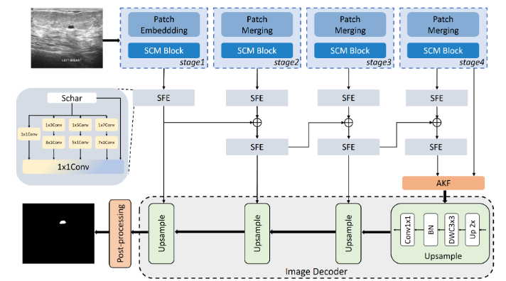
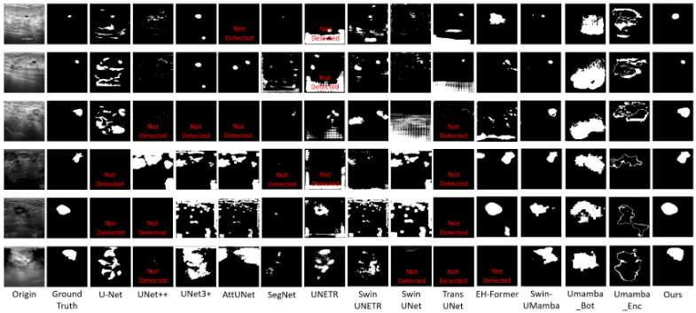

# SCEANet: A Spatial-Channel Mamba Architecture with Edge Awareness for Breast Lesion Ultrasound Image Segmentation

## Main result

### We will gradually update our code repository. Please be patient and wait. If you have any questions, you can publish them in issues.

## Installation

## Prepare data 

**Dataset:**  

## Training && Test

## Acknowledgement

## Citation

